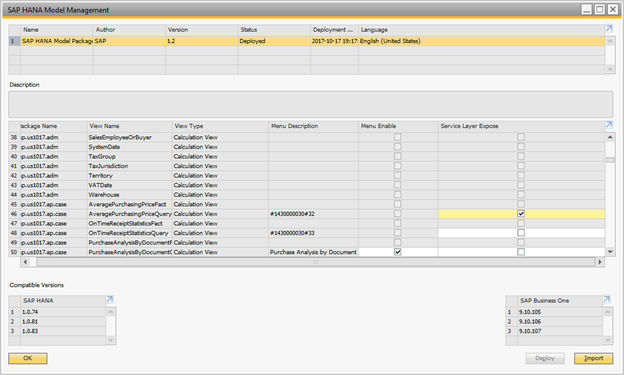

# Views Deployment, Exposure Scope and OData Version

## Views Deployment

Semantic Layer views are on top of SAP Business One Analytic Service and fall into two categories: system built-in views and customized views.

The author of the first category is generally SAP and you can deploy the views by following these steps after installing Analytic Service:

1. Open the SAP Business One analytics home page. (The URL is basically like: `https://databaseserver:40000/Enablement/`)
2. Navigate to the *Company* tab
3. Click the *Initialize* button to start the initialization process. After initialization, the views should be available in the Content package of the current SAP HANA instance in the SAP HANA studio.

For the customer view deployment, see subsequent sections.

## View Exposure Scope

Semantic Layer has various kinds of views. Not all views are appropriate to be in the exposure scope.

- For the system built-in views, only the views satisfying all the below conditions are eligible for exposure:
  - With the calculation view type.
  - With the `Query` postfix in its name, for example, `SalesOrderDetailQuery`, `BalanceSheetQuery`, and so on.
- For the customized views, as long as the view is of type calculation, the view is eligible for exposure.

All eligible views are not exposed by default. To expose them, you can manually perform the following steps:

1. Start SAP Business One client.
2. Open the *SAP HANA Model Management* window.
3. Select views and check the corresponding *Service Layer Expose* checkbox.
4. Restart Service Layer to effect the changes.

Figure: The SAP HANA Model Management window with the Service Layer Expose checkbox.

## View Exposure OData Version

Considering OData version 4 is the latest and prevalent protocol in OData world, Semantic Layer service is exposed in this version by default. Another advantage that comes with this is that implementing OData version 4 would make it possible for Semantic Layer service to be integrated with those SAP components (e.g. **WEB IDE**), which have supported or are going to support OData 4.

Meanwhile, OData 3 is supported as well, but it is not the default supported OData version. Clients must set the request header `OData-MaxVersion: 3.0` or `MaxDataServiceVersion: 3.0` to specify OData 3.
