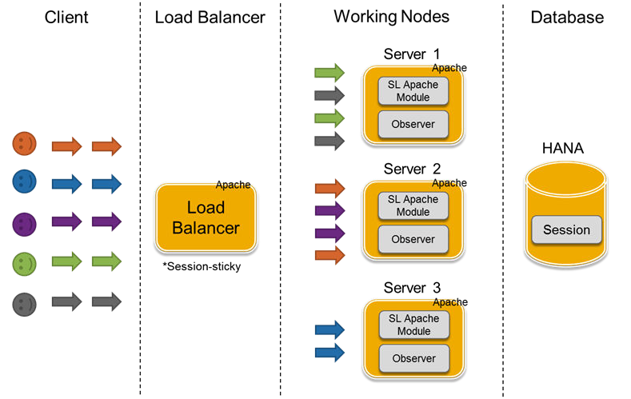

# High availability and load balancing

In the context of Web-based mobile-accessible applications, providing highly available services becomes increasingly important. Service Layer is well-designed and thoroughly tested to ensure that it will be continuously operational for a significant length of time in a production system.

By default, Service Layer installs Apache Multi-Processing Modules (MPMs) and is configured as a loadbalancing cluster. A central load balancer distributes HTTP loads amongst its nodes according to the number of requests. In addition, Service Layer implements sticky sessions to avoid an unnecessary login, which is considered a heavy job in SAP Business One, because same session requests will always be forwarded to the same working node. Those working nodes can be deployed in a clustered system, where hardware and software redundancy helps to scale performance and provide high availability.

Figure: Load-balancing architecture. Five clients, each sending requests, connect to a session-sticky Apache load balancer, which distributes them to three working nodes (Server 1, Server 2 and Server 3). Each server runs an Apache process with an SL Apache Module and an Observer. All servers share one HANA database that stores the sessions.

In an exceptional case, if the load balancer detects that one of its nodes has failed, it forwards subsequent requests to another valid node. The receiving node validates the session through the shared session info stored in the database. If valid, the receiving node automatically logs the user in, without interrupting the user actions or asking for user credentials. End-users will not notice the internal node failure, other than in a slight delay of the system response.
