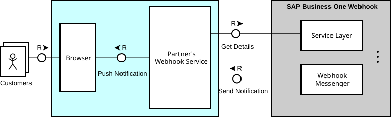

# Webhook Service Sample (Node.js)

This sample demonstrates how to implement a webhook service for SAP Business One using Node.js. It provides a secure server to receive webhook events and a simple SAPUI5-based web UI to display them. 




---

## 🚀 Features

- Process webhook events from SAP Business One with authentication
- Push events to connected browser clients via WebSocket
- Display received events in a modern web UI (SAPUI5)
- Retrieve event details from Service Layer via a technical user

---

## 🛠 Prerequisites

- Node.js (v18 or higher)
- SAP Business One system pre-configured for webhooks and ensure the Webhook Messenger service is running in your local environment.
- SSL certificates for HTTPS (self-signed or from a trusted CA). This sample by default uses a self-signed certificate with localhost as its subject name. If you want to use your own certificate, place the `server.key` and `server.cert` files in the `cert/` directory.
- Register the webhook service itself as a daemon app in SAP Business One Extension SSO Manager by following the extension guide in the [Identity and Authentication Management in SAP Business One](https://help.sap.com/docs/SAP_BUSINESS_ONE_IAM/548d6202b2b6491b824a488cfc447343/daae6f2762a14b6180134713f956b157.html?version=10.0_SP_2508) document. After generating the client credentials, configure it in the `.env` file.

---

## ⚡️ Quick Start

1. **Download sample:**
   Unzip the sample `webhook-service-sample-nodejs.zip` and navigate to the extracted folder.

2. **Install dependencies:**
   ```sh
   npm install
   ```
3. **Set up SSL certificates:**
   - Place your own `server.key` and `server.cert` files in the `cert/` directory if you do not want to use the provided a self-signed certificate.
   - If using self-signed certificate, import it into your trusted certification store to avoid the browser security warnings. For self-signed certificate, you also need to import it into the Webhook Messenger key store by using the tool under the installation folder. For example, on Windows, it is located at the folder `C:\Program Files\SAP\SAP Business One Webhook Messenger\tools`, while on Linux it is in general under `/usr/sap/SAPBusinessOne/WebhookMessenger/tools`.
  
1. **Start the server:**
   ```sh
   npm start
   ```
2. **Open the UI:**
   - Go to [https://localhost:3000](https://localhost:3000) in your browser. 
  
   **Note**: 
   
   The FQDN of the URL must match the subject name (Common Name or, preferably, a Subject Alternative Name) in the SSL certificate.  If they don’t match, the webhook messenger will fail to establish the connection. For this sample, using https://localhost:3000 requires a certificate that contains "localhost" as a SAN/CN.

---

## 🔗 SAP Business One Webhook Configuration

Follow the webhook user guide in the SAP Business One Service Layer document,  configure your SAP Business One System to send events to the following webhook endpoint. On success, events received will appear in the web UI.

```
https://localhost:3000/webhook
```

If you want to test different authentication modes, you can use the following endpoints:
- No Authentication: `https://localhost:3000/webhook/none`
- Basic Authentication: `https://localhost:3000/webhook/basic`
- HMAC Authentication: `https://localhost:3000/webhook/hmac`
- OAuth Authentication: `https://localhost:3000/webhook/oauth`

---

## 📁 Project Structure

```
.
├── server.js           # Main server file
├── helpers.js          # Helper functions
├── cert/               # SSL certificates
└── ui/webapp/          # SAPUI5 web application
    ├── Component.js
    ├── index.html
    ├── manifest.json
    ├── controller/
    ├── model/
    ├── resources/
    └── view/
```

## 📝 Notes

- This project is provided as a basic example for demonstration and sample purposes only.
- It is not production-ready and should be thoroughly reviewed, tested, and enhanced before using in a production environment.

## 📄 License

MIT License. See the [LICENSE](LICENSE) file for details.